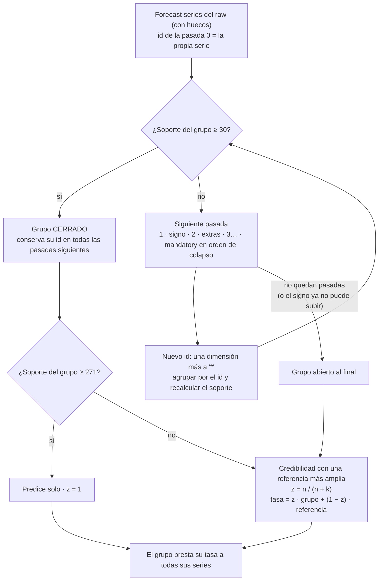

# La escalera de soporte (pasos 10 y 11)

## Qué resuelve

La tasa de renovación de un mes es *renovadas / vencen*. Con pocos contratos esa tasa oscila por puro azar (error binomial √(p(1−p)/n)). La escalera junta las forecast series, paso a paso, hasta que cada grupo tiene soporte suficiente. El grupo presta su tasa a sus series.

Dos umbrales:

| Umbral | Valor | Qué significa |
|---|---|---|
| `support_floor` | 30 contratos al mes | hay evidencia: el grupo deja de juntarse (se **cierra**) |
| `own_rate_floor` | 271 contratos al mes | hay precisión (±5 pp): el grupo predice solo, sin credibilidad |

## El proceso

## Las pasadas y su orden

| Pasada | Qué hace | Por qué en este orden |
|---|---|---|
| 0 · itself | el id es la propia serie | punto de partida: el raw con huecos |
| 1 · sign | las señales activas (dormant, softcancel…) se resumen en su signo: `SIG=negativo` / `positivo` / `neutro` | decidido así: el signo nunca se pierde |
| extras | una pasada por cada `extra_renovacion`, la menos informativa primero (contribución única del paso 09): su valor pasa a `*` | afinan la tasa, pero no definen el negocio |
| mandatory | una pasada por dimensión mandatory, en el **orden de colapso** del paso 09: primero la que menos R² cuesta quitar; un `_level_2` antes que su `_level_1` | al juntar series se juntan las que renuevan parecido: el menor sesgo posible |

Hay tres reglas más:
- **Los grupos con signo** (negativo o positivo) solo siguen quitando mandatory mientras la pérdida acumulada de R² sea ≤ `signed_ladder_max_loss` (0,05).
- **Una serie con señales de los dos signos** (mixta) nunca se junta.
- **El proceso se para** en cuanto no queda ningún grupo abierto que pueda moverse.

## Cada pasada es un reparto

En cada pasada, cada serie está en **un** grupo. Por eso agrupar por el id de cualquier pasada da los mismos totales que el raw, con menos series y más grandes. Así se puede medir cuánto mejora el soporte en cada pasada (tabla `sff_ladder_summary` y capítulo 3 del informe).

## Ejemplo

Ocho forecast series; suelo = 30. Total: **2.668** contratos al mes.

| Serie | Región | Producto | Señal | Canal | Soporte |
|---|---|---|---|---|---|
| S1 | EU | Premium | neutro | web | 2.440 |
| S2 | EU | Premium | neutro | shop | 18 |
| S3 | EU | Premium | dormant | web | 12 |
| S4 | EU | Premium | softcancel | web | 9 |
| S5 | EU | Premium | dormant | shop | 10 |
| S6 | EU | Plus | neutro | web | 150 |
| S7 | EU | Plus | neutro | shop | 25 |
| S8 | NA | Premium | dormant | web | 4 |

| Pasada | Qué pasa | Grupos | Total |
|---|---|---|---|
| 0 · itself | S1 (2.440) y S6 (150) llegan a 30 y se cierran | 8 | 2.668 |
| 1 · sign | S3 + S4 → `EU\|Premium\|NEG\|web` (21) · S5 → `EU\|Premium\|NEG\|shop` (10) · S8 → `NA\|Premium\|NEG\|web` (4) | 7 | 2.668 |
| 2 · sin canal | S3 + S4 + S5 → `EU\|Premium\|NEG\|*` (**31**, se cierra) · S2 → `EU\|Premium\|neutro\|*` (18) · S7 → `EU\|Plus\|neutro\|*` (25) | 6 | 2.668 |
| 3 · sin producto | S2 + S7 → `EU\|*\|neutro\|*` (**43**, se cierra) · S8 → `NA\|*\|NEG\|*` (4) | 5 | 2.668 |
| 4 · sin región | S8 → `*\|*\|NEG\|*`: sigue en 4 (las demás negativas ya están cerradas) | 5 | 2.668 |

El orden "canal → producto → región" es inventado para el ejemplo. El real lo decide el paso 09.

**Credibilidad** (k = 60). La referencia de un grupo es su propio id o el de una pasada posterior, contado sobre **todas** las series, también las cerradas y las grandes. Se elige la primera candidata que tiene más series que el grupo y llega a 30.

| Grupo final | n | Referencia | N | z | Tasa |
|---|---|---|---|---|---|
| S1 | 2.440 | — | — | 1 | la suya |
| S6 | 150 | `EU\|*\|neutro\|*` (incluye S1) | 2.633 | 0,71 | 0,71 · S6 + 0,29 · referencia |
| `EU\|Premium\|NEG\|*` | 31 | `*\|*\|NEG\|*` | 35 | 0,34 | 0,34 · grupo + 0,66 · referencia |
| `EU\|*\|neutro\|*` | 43 | `EU\|*\|neutro\|*` con S1 y S6 | 2.633 | 0,42 | 0,42 · grupo + 0,58 · referencia |
| S8 | 4 | `*\|*\|NEG\|*` | 35 | 0,06 | casi toda la de la referencia |

**Dos tipos de id:**
- **El id de grupo** es un reparto: suma, y es el que se predice (paso 12) y se juzga (paso 14).
- **El id de referencia** es una fuente de tasa. Cada serie tiene una sola referencia, pero la tasa de la referencia se calcula con todas las series que encajan en ella, así que su soporte puede ser mayor que la suma de las series que la tienen asignada.

## En el forecast

1. **Paso 12:** la serie mensual de cada grupo final (la suma de sus series).
2. **Paso 14:** el backtest elige la técnica de cada grupo.
3. **Paso 17:** la técnica predice la tasa del grupo en cada mes futuro. Si z < 1, esa predicción se desplaza hacia la referencia en (1 − z) de la diferencia de niveles, en escala logit: es la misma mezcla del paso 11 aplicada a la predicción. Todas las series del grupo reciben esa tasa, por su propia pipeline.

## Niveles de riesgo

| Nivel | Regla |
|---|---|
| A_propio | la propia serie (pasada 0), ≥ 271 y al menos 12 meses |
| A2_propio_corto | la propia serie, ≥ 271, menos de 12 meses |
| A3_propio_reforzado | la propia serie, entre 30 y 271: credibilidad con su referencia |
| B_prestado | se juntó en la pasada de signo o de extras: su grupo comparte TODAS las mandatory |
| C_lejano | se juntó en una pasada mandatory, o su grupo no llegó a 30 |
| S_signo_bajo_suelo | con signo y su grupo no llegó a 30 |
| M_signo_mixto · D_sin_historia · N_sin_impacto | mixta · solo futuro · solo historia |

## Tablas y columnas

| Tabla | Una fila por | Columnas clave |
|---|---|---|
| `sff_ladder_steps` | serie × pasada | `ladder_step`, `step_name`, `group_id`, `group_support`, `closed` |
| `sff_ladder_summary` | pasada | `groups`, `open_groups`, `median_group_support`, `units_due` (igual en todas), `pct_usd_floor`, `pct_usd_own_rate` |
| `sff_ladder_groups` | serie estimable | `final_group_id`, `final_step`, `group_series`, `group_support`, `group_rate`, `credibility_ref_id`, `credibility_ref_step`, `ref_series`, `ref_support`, `ref_rate` |
| `sff_series_estimacion` | serie | lo anterior + `k`, `z`, `tasa_estimada`, `se_estimacion_pp`, `se_prediccion_pp`, `nivel_riesgo` |
| `sff_nucleo` | fila | `s11_final_group_id`, `s11_final_step`, `s11_group_support`, `s11_group_rate`, `s11_credibility_ref_id`, `s11_ref_support`, `s11_ref_rate`, `s11_z`, `s11_tasa_estimada`… |

En Power BI, `group_id` filtrado por `ladder_step` agrupa el raw tal como queda en cada pasada.

## Decisión abierta

Con el reparto, una serie grande se cierra en la pasada 0 y ya no acepta a nadie. Las series pequeñas solo pueden juntarse entre ellas, y a veces cruzan región o producto antes de llegar a 30.

En el sintético, `NA|A|tele` acaba con las otras "tele" de EU en `*|*|SIG=neutro|*` y su tasa baja de 0,894 a 0,760. Con el modelo anterior tomaba la de su hermana grande `NA|A|web` (0,899). El examen de cartera empeora ligeramente: error del total a 6 meses de 2,06 % a 2,25 %.

La alternativa es que un grupo cerrado conserve sus series pero **absorba** en pasadas posteriores las series abiertas que coinciden con él en esa pasada. El reparto se mantiene y los totales siguen sumando, pero su id se amplía.
