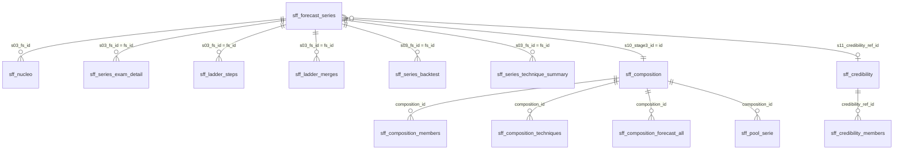

# El modelo de datos: hechos, dimensión de forecast series y satélites

## Principio

- **La forecast serie es la unidad con la que se habla con negocio.** Cada número del forecast es de una forecast serie: sus unidades que vencen, su tasa y su uplift.
- **Las 4 etapas de la escalera solo mejoran las condiciones de predicción.** El entrenamiento, el examen y la proyección se vuelven a referir a cada forecast serie.
- **Dos tablas centrales, un grano cada una:**
  - `sff_nucleo` es la **tabla de hechos**: una fila por registro (los originales y los sintéticos), con sus medidas y los valores propios de la fila;
  - `sff_forecast_series` es la **dimensión**: una fila por forecast serie, con todo lo de su nivel (etapas, composición, credibilidad, técnica, dinámica, examen y confianza).
- **Las tablas satélite son para el análisis en profundidad.** Se unen por sus claves y cada una se comprueba contra la tabla de la que sale (paso AUD).
- **Nada se cuenta dos veces.** Un valor de la serie vive una sola vez, en la dimensión; por eso sus sumables se suman sin trucos.

## El diagrama

## La tabla de hechos: `sff_nucleo`

Una fila por registro: las filas del extracto, los huecos (meses sin vencimientos), las filas proyectadas y simuladas del horizonte, y las del universo time_series.

| Bloque | Columnas | Qué dice |
|---|---|---|
| Dimensiones y mes | las del extracto, `period` | el grano fino |
| Medidas | `s00_*`, `s02_*` | lo que vence y renueva, antes y después del calendario |
| Ids | `s03_fs_id`, `s03_fu_id`, `s03_uplift_cell_id` | la forecast serie (clave de la dimensión), la unidad y la celda de precio |
| Unidad | `s04_filas_finas`, `s07_moe_pp_max` | el detalle de la forecast unit |
| Forecast | `s17_*`, `s17_confidence` | tasa, banda, uplift, esperado y confianza de cada fila futura |
| Final | `fin_*` | lo que se suma para responder: renovado real y previsto, pipeline, por año y origen |

## La dimensión: `sff_forecast_series`

Una fila por forecast serie. Es la tabla que se filtra en Power BI.

| Bloque | Columnas | Qué dice |
|---|---|---|
| Ruta y tasa propia | `s06_*`, `s08_n_propio`, `s08_tasa_propia`, `s08_error_binomial_pp`, `s08_signo` | la serie sola: su soporte, su tasa y el error de un mes |
| Etapas 0-3 | `s10_stage0_id` … `s10_stage3_id` con su `_support` | cuánto soporte gana en cada etapa; `stage3` es su **composición** |
| Etapa 4 · credibilidad | `s11_composition_series`, `s11_composition_rate`, `s11_credibility_ref_id`, `s11_k`, `s11_z`, `s11_tasa_estimada`, `s11_credibility_effect_pp`, `s11_se_prediccion_pp`, `s11_nivel_riesgo` | cuánto se fía de su composición, cuánto mueve la tasa la referencia, y el error de la predicción |
| Dinámica de su composición | `s13_phi`, `s13_tendencia`, `s13_estacional`… | φ, tendencia y estacionalidad de la composición |
| Técnica | `s14_tecnica_<tramo>`, `s14_examen_err_pp_<tramo>`… | la técnica elegida por tramo y su error en el examen |
| Dinámica propia | `s13_series_phi`, `s13_series_trend`, `s13_series_seasonal`, `s13_series_measurable`, `s13_series_differs` | la de la propia serie, para cruzarla con la precisión |
| Examen, ratios | `s19_exam_mae_pp`, `s19_exam_bias_pp`, `s19_exam_wape`, `s19_exam_coverage`, `s19_raw_mae_pp`, `s19_raw_coverage`, `s19_improvement_mae_pp` | cuánto acertó el framework, cuánto la serie sola (raw) y la diferencia |
| Examen, sumables | `s19_exam_predictions`, `s19_exam_in_band`, `s19_exam_pred_units`, `s19_exam_real_units`, `s19_exam_abs_err_units`, `s19_raw_predictions`, `s19_raw_in_band`, `s19_raw_real_units`, `s19_raw_abs_err_units` | para sumar el acierto sobre cualquier filtro |
| Dinero y confianza | `s17_esperado_usd_total`, `s17_pct_usd_high` / `_medium` / `_low`, `s17_confidence` | lo que se espera renovar y con qué confianza (la de la mayor parte de su dinero) |

`sff_nucleo_leyenda` describe las columnas de las dos tablas: la columna `tabla` dice a cuál pertenece cada una, y `como_agregar` cómo sumarla.

## Ver la mejora frente al raw (Power BI)

**Relación:** `sff_forecast_series[s03_fs_id]` 1 → n `sff_nucleo[s03_fs_id]`, en una sola dirección. Al filtrar una o varias forecast series en la dimensión, se filtran sus filas.

**Gráficos para una forecast serie seleccionada,** sobre tablas relacionadas por `fs_id`:

| Gráfico | Datos |
|---|---|
| Soporte por etapa (raw → composición) | `s10_stage0_support` … `s10_stage3_support` de la dimensión |
| Error del raw frente al de la estimación | `s08_error_binomial_pp` frente a `s11_se_prediccion_pp` |
| Examen mes a mes: real, raw, framework y hoja, con el intervalo | `sff_series_exam_detail` (una fila por mes × horizonte × método) |
| Cómo se formó su composición | `sff_ladder_steps` y `sff_ladder_merges` (sesgo, error sola y junta) |
| Quién entra en la tasa de su composición | `sff_composition_members` (`uses` / `lends`) |

**Medidas sobre cualquier filtro:**

| Medida | DAX |
|---|---|
| Examen: dentro del intervalo (framework) | `DIVIDE(SUM(sff_forecast_series[s19_exam_in_band]), SUM(sff_forecast_series[s19_exam_predictions]))` |
| Examen: dentro del intervalo (raw) | `DIVIDE(SUM(sff_forecast_series[s19_raw_in_band]), SUM(sff_forecast_series[s19_raw_predictions]))` |
| WAPE framework | `DIVIDE(SUM(sff_forecast_series[s19_exam_abs_err_units]), SUM(sff_forecast_series[s19_exam_real_units]))` |
| WAPE raw | `DIVIDE(SUM(sff_forecast_series[s19_raw_abs_err_units]), SUM(sff_forecast_series[s19_raw_real_units]))` |
| Sesgo del total (framework) | `DIVIDE(SUM(sff_forecast_series[s19_exam_pred_units]), SUM(sff_forecast_series[s19_exam_real_units])) - 1` |
| Renovado (real + previsto) | `SUM(sff_nucleo[fin_renovado_usd])`, segmentado por `fin_ano`, `fin_estado`, `fin_origen` |
| Tasa de renovación (meses cerrados) | `DIVIDE(SUM(sff_nucleo[s02_renovadas_unidades]), SUM(sff_nucleo[s00_vencen_unidades]))` con `s02_rol` en entrenamiento y examen |

Para cruzar el acierto con la dinámica se segmenta por `s13_series_*` (por ejemplo, volatilidad alta frente a baja). El informe trae esa tabla en el capítulo 5.

## Las satélites

| Tabla | Una fila por | Clave | Para qué |
|---|---|---|---|
| `sff_series_exam_detail` | forecast serie × mes de examen × horizonte × método | `fs_id` | cada predicción del examen (raw, framework, hoja), trazada: tasa de la composición, desplazamiento por credibilidad, tasa, intervalo, real, error |
| `sff_series_exam` | forecast serie | `fs_id` | el examen resumido por método, raw y framework lado a lado (la dimensión lo lleva) |
| `sff_ladder_steps` | forecast serie × pasada | `fs_id` | su id en cada pasada, el soporte de su grupo y si ya tiene composición |
| `sff_ladder_merges` | forecast serie × fusión | `fs_id` | grupo antes y después, sesgo, error sola y junta, y si la fusión mejora |
| `sff_composition_members` | composición × forecast serie | `composition_id` | todas las series de su tasa: `uses` (predice con ella) o `lends` (solo presta su historia) |
| `sff_composition` | id de cualquier etapa | `s10_stageN_id` | quién lo forma, soporte, tasa; si es composición, cómo se predice |
| `sff_composition_techniques` | composición × tramo × técnica | `composition_id` | estado (`tested` / `not_enough_history` / `composition_below_floor`), errores, ranking, elegida |
| `sff_composition_forecast_all` | composición × horizonte futuro × técnica | `composition_id` | la tasa futura que daría cada técnica, no solo la elegida |
| `sff_pool_serie` | composición × mes | `composition_id` | la serie mensual de la composición (suma de todas las series de su tasa) |
| `sff_credibility` | referencia de credibilidad | `s11_credibility_ref_id` | soporte, tasa, k y sus partes |
| `sff_credibility_members` | referencia × forecast serie | `credibility_ref_id` | qué series entran en la tasa de la referencia: `borrower` (se apoya en ella) o `lender` (solo aporta datos) |
| `sff_series_dynamics` | forecast serie | `fs_id` | φ, tendencia y estacionalidad de la propia serie, y si son medibles |
| `sff_series_backtest` | forecast serie × mes de examen × horizonte × técnica | `fs_id` | cada técnica aplicada a la forecast serie, con su intervalo |
| `sff_series_technique_summary` | forecast serie × tramo × técnica | `fs_id` | error medio, sesgo, WAPE, ranking en la serie, elegida, mejor para la serie |
| `sff_dimension_levels` | dimensión × grupo | — | los grupos generados de `level_1` (paso 02b), con su tasa estandarizada por año |

## Las sumas de comprobación

**Núcleo (paso NU):**
1. Cada registro original y cada fila sintética aparece una vez.
2. El dinero concilia con el extracto.
3. Cada fila tiene los valores de cada bloque presente.
4. La leyenda describe cada columna.
5. El núcleo sumado por año y origen es `sff_forecast_total`.
6. La dimensión tiene una fila por forecast serie del núcleo.
7. Los sumables del examen en la dimensión son los del paso 19 (cada serie una vez).

**Examen (paso 19):**
1. Ninguna predicción usa un mes posterior a su origen (T − h).
2. Los tres métodos predicen exactamente las mismas filas.
3. Las renovaciones reales del examen son las de los meses de examen.
4. El resumen por serie suma el detalle.

**Auditoría (paso AUD):**
1. Cada etapa es un reparto: las unidades que vencen de sus ids suman las del raw.
2. Cada etapa contiene cada forecast serie estimable una sola vez.
3. Cada composición y tramo tiene una técnica elegida, la del paso 14.
4. Soporte, tasa y series de cada referencia, recalculados desde sus miembros, son los usados.
5. Hay una fila de dinámica por forecast serie estimable.
6. Cada composición es la suma de todas las series de su tasa (las que la usan y las que prestan) en cada mes de examen.
7. Sin credibilidad, cada serie predice exactamente la tasa de su composición.
8. Cada forecast serie y tramo tiene una técnica elegida en su resumen.
9. La técnica elegida da la tasa que usó el forecast.
10. La técnica elegida, aplicada a cada serie, da la misma predicción que el framework del paso 19: hay una sola forma de predecir (`prediction.py`).

## Cómo auditar una forecast serie

1. **En la dimensión:** su ruta, su soporte propio y el de su composición, su nivel de riesgo, su confianza, y el examen raw frente a framework.
2. **En el núcleo:** sus filas, su renovado previsto y su banda (`s17_*`, `fin_*`).
3. **Cómo se formó su composición:** `sff_ladder_steps` (pasada a pasada) y `sff_ladder_merges` (si cada fusión mejoró).
4. **Su composición** (`s10_stage3_id` → `sff_composition` y `sff_composition_members`): quién entra en su tasa y quién la usa.
5. **Las técnicas** (`sff_composition_techniques`, `sff_composition_forecast_all`): las probadas, las descartadas y por qué, y lo que habría dado cada una.
6. **La credibilidad** (`s11_credibility_ref_id` → `sff_credibility` y sus miembros): cuánto pesa la referencia y por qué ese k.
7. **El examen** (`sff_series_exam_detail`): cada predicción, mes a mes, de los tres métodos, con su intervalo.
8. **Su dinámica** (`sff_series_dynamics`): si tiene tendencia o estacionalidad propia, y si es medible.
