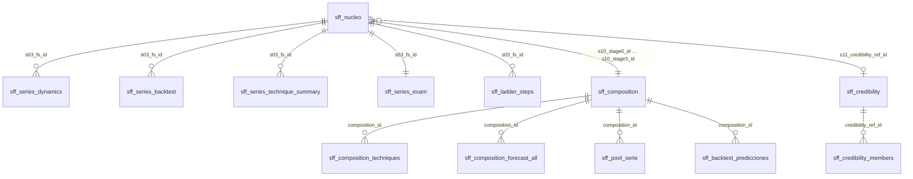

# El modelo de datos: el núcleo y sus satélites

## Principio

- **La forecast serie es la unidad con la que se habla con negocio.** Cada número del forecast es de una forecast serie: sus unidades que vencen, su tasa y su uplift.
- **Las 4 etapas de la escalera solo mejoran las condiciones de predicción.** Juntan forecast series para tener soporte y estimar mejor la tasa. El entrenamiento, el examen y la proyección se vuelven a referir a cada forecast serie.
- **`sff_nucleo` es la tabla final:** todos los registros (los originales y los sintéticos) con el resumen de todas las decisiones. Con él se hace el informe.
- **Las tablas satélite son para el análisis en profundidad.** Cuando se duda de dónde sale un número, explican todo el camino. Se unen al núcleo por sus claves.
- **Nada se cuenta dos veces.** Cada satélite se comprueba contra la tabla de la que sale (paso AUD).

## El diagrama

## El núcleo: lo que necesita el informe

Por cada forecast serie, en cada una de sus filas:

| Bloque | Columnas | Qué dice |
|---|---|---|
| Etapa 0 · raw | `s10_stage0_id`, `s10_stage0_support` | la forecast serie y su soporte propio |
| Etapa 1 · signo | `s10_stage1_id`, `s10_stage1_support` | su grupo tras unir las señales por signo |
| Etapa 2 · extras | `s10_stage2_id`, `s10_stage2_support` | su grupo tras anular las extras |
| Etapa 3 · colapso | `s10_stage3_id` (la **composición**), `s10_stage3_support`, `s11_composition_series`, `s11_composition_rate` | el grupo con el que se predice |
| Etapa 4 · credibilidad | `s11_credibility_ref_id`, `s11_ref_support`, `s11_ref_rate`, `s11_k`, `s11_z`, `s11_tasa_estimada`, `s11_credibility_effect_pp` | cuánto se fía de su composición y cuánto mueve la tasa la referencia |
| Dinámica de la composición | `s13_*` | φ, tendencia y estacionalidad de su composición |
| Backtest | `s14_*` | técnica elegida por tramo y su error en el examen |
| Dinámica de la propia serie | `s13_series_phi`, `s13_series_trend`, `s13_series_trend_pp_year`, `s13_series_seasonal`, `s13_series_amplitude_pp`, `s13_series_measurable`, `s13_series_differs` | volatilidad (φ), tendencia y estacionalidad de la forecast serie, y si son medibles: para cruzar con la precisión |
| Precisión en el examen | ratios repetidos en todas sus filas: `s19_exam_status`, `s19_exam_mae_pp`, `s19_exam_bias_pp`, `s19_exam_wape`, `s19_exam_coverage` · sumables **solo en su primera fila**: `s19_exam_predictions`, `s19_exam_in_band`, `s19_exam_pred_units`, `s19_exam_real_units`, `s19_exam_abs_err_units` | cuánto acertó la técnica elegida en esta forecast serie y cuántas predicciones cayeron dentro de su intervalo |
| Forecast | `s17_*`, `s17_confidence` | tasa, banda, uplift, esperado y **confianza** (high / medium / low) |
| Final | `fin_*` | lo que se suma para responder: renovado real y previsto, pipeline, por año y origen |

Agrupando por cualquier `s10_stageN_id`, los totales suman lo mismo (cada etapa es un reparto). Si una etapa no aporta nada, su id y su soporte repiten los de la anterior.

## Las satélites

| Tabla | Una fila por | Clave en el núcleo | Para qué |
|---|---|---|---|
| `sff_ladder_steps` | forecast serie × pasada | `s03_fs_id` | el camino fino: en qué pasada se juntó y con qué soporte |
| `sff_composition` | id de cualquier etapa | `s10_stageN_id` | quién lo forma, soporte, tasa; y si es composición, cómo se predice (técnica, examen, credibilidad, dinero por confianza) |
| `sff_composition_techniques` | composición × tramo × técnica | `s10_stage3_id` | estado (`tested` / `not_enough_history` / `composition_below_floor`), meses disponibles y necesarios, errores en selección y examen, ranking, elegida |
| `sff_composition_forecast_all` | composición × horizonte futuro × técnica | `s10_stage3_id` | la tasa futura que daría cada técnica, no solo la elegida |
| `sff_pool_serie` | composición × mes | `s10_stage3_id` | la serie mensual de la composición |
| `sff_backtest_predicciones` | composición × mes × horizonte × técnica | `s10_stage3_id` | todas las pruebas sobre la composición |
| `sff_credibility` | referencia de credibilidad | `s11_credibility_ref_id` | soporte, tasa, k y sus partes (`within_variance`, `between_variance`, `k_source`) |
| `sff_credibility_members` | referencia × forecast serie | `s11_credibility_ref_id` | qué forecast series entran en la tasa de la referencia: `borrower` (se apoya en ella) o `lender` (solo aporta datos) |
| `sff_series_dynamics` | forecast serie | `s03_fs_id` | φ, tendencia y estacionalidad de la propia serie; `measurable` (`yes` / `low_support` / `short_history`) y `differs_from_composition` |
| `sff_series_backtest` | forecast serie × mes de examen × horizonte × técnica | `s03_fs_id` | cada técnica aplicada a la forecast serie: tasa predicha × sus unidades que vencen, frente a lo que renovó |
| `sff_series_technique_summary` | forecast serie × tramo × técnica | `s03_fs_id` | error medio, sesgo, WAPE, ranking en la serie, elegida, mejor para la serie |
| `sff_series_exam` | forecast serie | `s03_fs_id` | el examen de su técnica elegida: predicciones, en intervalo, unidades predichas y reales, error, y si no tiene examen, por qué |

## Las sumas de comprobación (paso AUD)

| # | Comprobación |
|---|---|
| 1 | cada etapa es un reparto: las unidades que vencen de sus ids suman las del raw |
| 2 | cada etapa contiene cada forecast serie estimable una sola vez |
| 3 | cada composición y tramo tiene exactamente una técnica elegida, la del paso 14 |
| 4 | soporte, tasa y número de series de cada referencia, recalculados desde sus miembros, son los usados |
| 5 | una fila de dinámica por forecast serie estimable |
| 6 | las forecast series de una composición suman sus meses de examen (unidades que vencen y renovadas) |
| 7 | sin credibilidad, las predicciones de las series suman la predicción de la composición |
| 8 | cada forecast serie y tramo tiene exactamente una técnica elegida en su resumen |
| 9 | la técnica elegida da exactamente la tasa que usó el forecast (filas sin desplazamiento por credibilidad) |
| 10 | el examen de cada serie suma sus predicciones elegidas (número y unidades) |
| 11 | al menos el 80 % de las predicciones del examen caen en su intervalo (solo aviso: si no, el intervalo promete más de lo que da) |

El núcleo tiene las suyas: los totales concilian con el extracto, y el núcleo agregado por año y origen es `sff_forecast_total`.

## Cómo sumarizar el acierto desde el núcleo

Cada prueba del examen tiene un **intervalo**, construido igual que la banda del forecast: los cuantiles de error de la técnica en el backtest, por el ruido binomial con las unidades que vencen de esa serie. Con el núcleo, para cualquier filtro (región, nivel de confianza, serie estacional…):

| Medida | Fórmula en Power BI |
|---|---|
| predicciones dentro de su intervalo | `SUM(s19_exam_in_band) / SUM(s19_exam_predictions)` |
| WAPE (error serie a serie, sin compensaciones) | `SUM(s19_exam_abs_err_units) / SUM(s19_exam_real_units)` |
| sesgo del total | `SUM(s19_exam_pred_units) / SUM(s19_exam_real_units) − 1` |

Los sumables están solo en la primera fila de cada forecast serie, así que un `SUM` normal cuenta cada serie una vez. Para cruzarlo con la dinámica, se segmenta por `s13_series_*` (por ejemplo, volatilidad alta frente a baja). El informe trae esa tabla en el capítulo 5.

## Cómo auditar una forecast serie

1. **En el núcleo:** su renovado previsto, su banda y su confianza (`s17_*`, `fin_*`).
2. **Las etapas:** `s10_stage0_support` a `s10_stage3_support` dicen cuánto soporte ganó y en qué etapa. El detalle por pasada está en `sff_ladder_steps`.
3. **Su composición** (`s10_stage3_id` → `sff_composition`): quién la forma y cómo se predice.
4. **Las técnicas** (→ `sff_composition_techniques`): las probadas, las descartadas y por qué, y la elegida. En `sff_composition_forecast_all`, lo que habría dado cada una en el futuro.
5. **La credibilidad** (`s11_credibility_ref_id` → `sff_credibility` y sus miembros): cuánto pesa la referencia, de qué series sale y por qué ese k.
6. **En la propia serie** (`sff_series_backtest`, `sff_series_technique_summary`, `sff_series_exam`): cómo le habría ido a cada técnica en ella, con su intervalo y su ruido binomial (`err_norm`). Distingue "esta técnica falló" de "aquí nada podía acertar".
7. **Su dinámica** (`sff_series_dynamics`): si tiene tendencia o estacionalidad propia, si eso es medible y si difiere de su composición.

## En Power BI

- **Relaciones activas:** `sff_nucleo[s10_stage3_id]` → `sff_composition[composition_id]`, y de ahí a sus técnicas y predicciones; `sff_nucleo[s03_fs_id]` → las satélites por forecast serie.
- **Una tabla solo admite una relación activa con otra.** Para ver la mejora por etapa no hace falta ninguna relación: los ids y los soportes de cada etapa están en el propio núcleo, basta con agrupar por la columna de la etapa.
- **`sff_credibility_members` no se suma entre referencias:** una forecast serie puede estar en la tasa de varias referencias (como `lender`). Cada forecast serie tiene **una** referencia asignada, que es la del núcleo.
