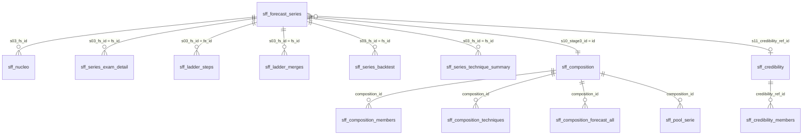

# El modelo de datos: hechos, dimensión de forecast series y satélites

## Principio

- **La forecast serie es la unidad con la que se habla con negocio.** Cada número del forecast es de una forecast serie: sus unidades que vencen, su tasa y su uplift.
- **Las 4 etapas de la escalera solo mejoran las condiciones de predicción.** El entrenamiento, el examen y la proyección se vuelven a referir a cada forecast serie.
- **Dos tablas centrales, un grano cada una:**
  - `sff_nucleo` es la **tabla de hechos**: una fila por registro (los originales y los sintéticos), con sus medidas y los valores propios de la fila;
  - `sff_forecast_series` es la **dimensión**: una fila por forecast serie, con todo lo de su nivel (etapas, composición, credibilidad, técnica, dinámica, examen y confianza).
- **Las tablas satélite son para el análisis en profundidad.** Se unen por sus claves y cada una se comprueba contra la tabla de la que sale (paso AUD).
- **Nada se cuenta dos veces.** Un valor de la serie vive una sola vez, en la dimensión; por eso sus sumables se suman sin trucos.

## El diagrama

## La tabla de hechos: `sff_nucleo`

Una fila por registro: las filas del extracto, los huecos (meses sin vencimientos), las filas proyectadas y simuladas del horizonte, y las del universo time_series.

| Bloque | Columnas | Qué dice |
|---|---|---|
| Dimensiones y mes | las del extracto, `period` | el grano fino |
| Medidas | `s00_*`, `s02_*` | lo que vence y renueva, antes y después del calendario |
| Ids | `s03_fs_id`, `s03_fu_id`, `s03_uplift_cell_id` | la forecast serie (clave de la dimensión), la unidad y la celda de precio |
| Unidad | `s04_filas_finas`, `s07_moe_pp_max` | el detalle de la forecast unit |
| Forecast | `s17_*`, `s17_confidence` | tasa, banda, uplift, esperado y confianza de cada fila futura |
| Final | `forecast_*` | lo que se suma para responder: renovado real y previsto, pipeline, por año y origen |
| Final, maduración del softcancel | `forecast_maturation_units_moved`, `forecast_renewed_units_maturation_adj`, `forecast_renewed_USD_maturation_adj` (de `maturation_flag_col`) | el ajuste AL LADO del forecast, nunca dentro: las unidades que se espera que se marquen antes de vencer pasan del lado sin marca al marcado y renuevan a la tasa de los marcados de su celda mandatory. `forecast_renewed_USD + forecast_renewed_USD_maturation_adj` = el forecast con las marcas esperadas al vencer. 0 donde no se ajusta (meses cerrados, horizonte extendido). Tabla `sff_forecast_maduracion`: mes a mes, marcado hoy frente a esperado, tasa hoy frente a esperada, ajuste y los dos vasos |
| Final, base exacta del uplift | `forecast_to_renew_USD_renewed` (de `renewed_pipeline_usd_col`) | el USD que vencía de los contratos que RENOVARON (construido licencia a licencia). Con él, uplift = Σ renovado USD / Σ esta columna: revalorización pura, condicionada a renovar. Solo en meses cerrados del extracto |
| Final, renovaciones isolated | `forecast_isolated_to_renew_units`, `forecast_isolated_renewed_units`, `forecast_isolated_renewed_USD`, `forecast_isolated_to_renew_USD_renewed` (de `isolated_pipeline_units_col`, `isolated_renewed_units_col`, `isolated_renewed_usd_col`, `isolated_renewed_pipeline_usd_col`) | las renovaciones del proceso normal, aisladas de cualquier evento de retención (en Kamelot: los contratos que nunca tuvieron softcancel, antes, durante ni después de la renovación). Nombres fijos del framework, se llamen como se llamen en el extracto. Solo en meses cerrados: la referencia para ver una subida de precio sin descuentos de retención |
| Final, dispersión de las isolated | `forecast_isolated_renewed_USD_sq_over_tr` (de `isolated_renewed_usd_sq_over_tr_col`) y `forecast_isolated_to_renew_USD_renewed_<tramo>` para lt095, 095_100, 100_105, 105_110, 110_120, ge120 (de `isolated_tr_usd_renewed_<tramo>_col`) | construidas licencia a licencia con ratio = USD renovado / lo que valía, y sumadas. El momento (Σ renovado² / lo que valía) da, con la base y el renovado isolated, la desviación típica exacta ponderada de cualquier grupo; los seis tramos reparten la base por ratio y suman exactamente la base isolated (el paso 01 lo comprueba) |

## Tablas del uplift y del monitor de precios

- `sff_uplift_homogeneidad` (paso 15, solo con la base exacta): una fila por celda de uplift con renovadores. `ratio_seleccion` = precio medio que vencía de los renovadores / precio medio de la celda: a 1, los renovadores valían la media y la aproximación antigua era exacta; por encima, renuevan más los caros y la aproximación inflaba el uplift en ese ratio (`uplift_aproximado = uplift_exacto × ratio_seleccion`). Donde se aleja de 1, la celda mezcla precios: la respuesta es segmentar mejor, no añadir un factor al forecast.
- `sff_price_increase_monitor` (paso 22): una fila por mes cerrado de pipeline. El uplift de todos y el de las renovaciones isolated (el detector: sin descuentos de retención), la media de los 12 meses anteriores, el escalón frente a ella, `above_threshold` (escalón ≥ 3 %), `price_increase_flag` (primer mes de una racha de ≥ 3 meses seguidos por encima: un mes suelto es ruido, no una subida), `in_increase_cycle` y `months_since_increase`. El uplift isolated usa su base exacta (`forecast_isolated_to_renew_USD_renewed`) cuando está; con la dispersión, además `desv_isolated`, `share_isolated_near_100` ([0,95, 1,05)) y `share_isolated_ge110`. Cada métrica del monitor necesita solo sus columnas. Una subida afecta a las renovaciones de UN ciclo (quien renueva paga la tarifa nueva contra la vieja; un año después todo lo que vence ya compró a la nueva), así que el ciclo dura 12 meses y se apaga.

## La dimensión: `sff_forecast_series`

Una fila por forecast serie. Es la tabla que se filtra en Power BI.

| Bloque | Columnas | Qué dice |
|---|---|---|
| Ruta y tasa propia | `s06_*`, `s08_n_propio`, `s08_tasa_propia`, `s08_error_binomial_pp`, `s08_signo` | la serie sola: su soporte, su tasa y el error de un mes |
| Etapas 0-3 | `s10_stage0_id` … `s10_stage3_id` con su `_support` | cuánto soporte gana en cada etapa; `stage3` es su **composición** |
| Etapa 4 · credibilidad | `s11_composition_series`, `s11_composition_rate`, `s11_credibility_ref_id`, `s11_k`, `s11_z`, `s11_tasa_estimada`, `s11_credibility_effect_pp`, `s11_se_prediccion_pp`, `s11_nivel_riesgo` | cuánto se fía de su composición, cuánto mueve la tasa la referencia, y el error de la predicción |
| Dinámica de su composición | `s13_phi`, `s13_tendencia`, `s13_estacional`… | φ, tendencia y estacionalidad de la composición |
| Técnica | `s14_tecnica_<tramo>`, `s14_examen_err_pp_<tramo>`… | la técnica elegida por tramo y su error en el examen |
| Dinámica propia | `s13_series_phi`, `s13_series_trend`, `s13_series_seasonal`, `s13_series_measurable`, `s13_series_differs` | la de la propia serie, para cruzarla con la precisión |
| Examen, ratios | `s19_exam_mae_pp`, `s19_exam_bias_pp`, `s19_exam_wape`, `s19_exam_coverage`, `s19_raw_mae_pp`, `s19_raw_coverage`, `s19_improvement_mae_pp` | cuánto acertó el framework, cuánto la serie sola (raw) y la diferencia |
| Examen frente al ruido | `s19_exam_rmse_pp`, `s19_exam_noise_pp`, `s19_exam_error_over_noise`, `s19_raw_error_over_noise` | el error frente al ruido binomial de su tasa: ≈ 1 es el límite (la regla del ruido) |
| Examen, sumables | `s19_exam_predictions`, `s19_exam_in_band`, `s19_exam_pred_units`, `s19_exam_real_units`, `s19_exam_abs_err_units`, `s19_raw_predictions`, `s19_raw_in_band`, `s19_raw_real_units`, `s19_raw_abs_err_units` | para sumar el acierto sobre cualquier filtro |
| Dinero y confianza | `s17_esperado_usd_total`, `s17_pct_usd_high` / `_medium` / `_low`, `s17_confidence` | lo que se espera renovar y con qué confianza (la de la mayor parte de su dinero) |

`sff_nucleo_leyenda` describe las columnas de las dos tablas: la columna `tabla` dice a cuál pertenece cada una, y `como_agregar` cómo sumarla.

## Ver la mejora frente al raw (Power BI)

**Relación:** `sff_forecast_series[s03_fs_id]` 1 → n `sff_nucleo[s03_fs_id]`, en una sola dirección. Al filtrar una o varias forecast series en la dimensión, se filtran sus filas.

**Gráficos para una forecast serie seleccionada,** sobre tablas relacionadas por `fs_id`:

| Gráfico | Datos |
|---|---|
| Soporte por etapa (raw → composición) | `s10_stage0_support` … `s10_stage3_support` de la dimensión |
| Error del raw frente al de la estimación | `s08_error_binomial_pp` frente a `s11_se_prediccion_pp` |
| Examen mes a mes: real, raw, framework y hoja, con el intervalo | `sff_series_exam_detail` (una fila por mes × horizonte × método) |
| Cómo se formó su composición | `sff_ladder_steps` y `sff_ladder_merges` (sesgo, error sola y junta) |
| Quién entra en la tasa de su composición | `sff_composition_members` (`uses` / `lends`) |

**Medidas sobre cualquier filtro:**

| Medida | DAX |
|---|---|
| Examen: dentro del intervalo (framework) | `DIVIDE(SUM(sff_forecast_series[s19_exam_in_band]), SUM(sff_forecast_series[s19_exam_predictions]))` |
| Examen: dentro del intervalo (raw) | `DIVIDE(SUM(sff_forecast_series[s19_raw_in_band]), SUM(sff_forecast_series[s19_raw_predictions]))` |
| WAPE framework | `DIVIDE(SUM(sff_forecast_series[s19_exam_abs_err_units]), SUM(sff_forecast_series[s19_exam_real_units]))` |
| WAPE raw | `DIVIDE(SUM(sff_forecast_series[s19_raw_abs_err_units]), SUM(sff_forecast_series[s19_raw_real_units]))` |
| Sesgo del total (framework) | `DIVIDE(SUM(sff_forecast_series[s19_exam_pred_units]), SUM(sff_forecast_series[s19_exam_real_units])) - 1` |
| Renovado (real + previsto) | `SUM(sff_nucleo[forecast_renewed_USD])`, segmentado por `forecast_year`, `forecast_status`, `forecast_pipeline_source` |
| Tasa de renovación (meses cerrados) | `DIVIDE(SUM(sff_nucleo[s02_renovadas_unidades]), SUM(sff_nucleo[s00_vencen_unidades]))` con `s02_rol` en entrenamiento y examen |

Para cruzar el acierto con la dinámica se segmenta por `s13_series_*` (por ejemplo, volatilidad alta frente a baja). El informe trae esa tabla en el capítulo 5.

## Las tablas auxiliares de Power BI (paso 22)

El paso 22 construye en Python el contexto que el informe necesita (nombres de negocio, orden, bloques), para que
Power BI solo relacione y sume, sin lógica dentro del informe.

| Tabla | Una fila por | Relación | Columnas |
|---|---|---|---|
| `sff_forecast_pipeline_source` | origen de la pipeline | `[forecast_pipeline_source]` 1 → n `sff_nucleo[forecast_pipeline_source]` | `source_label`, `source_block`, `source_order` (ordenar la etiqueta por esta columna) |

## Las satélites

| Tabla | Una fila por | Clave | Para qué |
|---|---|---|---|
| `sff_series_exam_detail` | forecast serie × mes de examen × horizonte × método | `fs_id` | cada predicción del examen (raw, framework, hoja), trazada: tasa de la composición, desplazamiento por credibilidad, tasa, intervalo, real, error y su ruido binomial (`noise_pp`) |
| `sff_series_exam` | forecast serie | `fs_id` | el examen resumido por método, raw y framework lado a lado (la dimensión lo lleva) |
| `sff_ladder_steps` | forecast serie × pasada | `fs_id` | su id en cada pasada, el soporte de su grupo y si ya tiene composición |
| `sff_ladder_merges` | forecast serie × fusión | `fs_id` | grupo antes y después, sesgo, error sola y junta, y si la fusión mejora |
| `sff_composition_members` | composición × forecast serie | `composition_id` | todas las series de su tasa: `uses` (predice con ella) o `lends` (solo presta su historia) |
| `sff_composition` | id de cualquier etapa | `s10_stageN_id` | quién lo forma, soporte, tasa; si es composición, cómo se predice |
| `sff_composition_techniques` | composición × tramo × técnica | `composition_id` | estado (`tested` / `not_enough_history` / `composition_below_floor`), errores, ranking, elegida |
| `sff_composition_forecast_all` | composición × horizonte futuro × técnica | `composition_id` | la tasa futura que daría cada técnica, no solo la elegida |
| `sff_pool_serie` | composición × mes | `composition_id` | la serie mensual de la composición (suma de todas las series de su tasa) |
| `sff_credibility` | referencia de credibilidad | `s11_credibility_ref_id` | soporte, tasa, k y sus partes |
| `sff_credibility_members` | referencia × forecast serie | `credibility_ref_id` | qué series entran en la tasa de la referencia: `borrower` (se apoya en ella) o `lender` (solo aporta datos) |
| `sff_series_dynamics` | forecast serie | `fs_id` | φ, tendencia y estacionalidad de la propia serie, y si son medibles |
| `sff_series_backtest` | forecast serie × mes de examen × horizonte × técnica | `fs_id` | cada técnica aplicada a la forecast serie, con su intervalo |
| `sff_series_technique_summary` | forecast serie × tramo × técnica | `fs_id` | error medio, sesgo, WAPE, ranking en la serie, elegida, mejor para la serie |
| `sff_dimension_levels` | dimensión × grupo | — | los grupos generados de `level_1` (paso 01), con su tasa estandarizada por año |
| `sff_dimension_level_values` | dimensión × valor | — | cada valor de una dimensión con nivel generado: su grupo, soporte, tasa, ruido y años |

## Los informes agregados no son tablas

Un informe con pocas filas porque está muy agregado se reproduce con una consulta sobre las tablas de detalle. El paso
que lo calcula imprime esa consulta (`report_queries.py`), y los tests comprueban que da el mismo resultado:

- las filas que el framework añade o borra (paso 21): no se escribe, desde `sff_nucleo`;
- el calendario por rol y por mes (paso 02), desde `sff_nucleo`;
- el examen por método y horizonte, y por mes (paso 19), desde `sff_series_exam_detail`;
- el total por año y origen (paso 20), desde `sff_nucleo`.

`sff_calendario`, `sff_examen_cartera(_resumen)` y `sff_forecast_total` todavía se escriben, aunque tengan su consulta.

## Las sumas de comprobación

**Núcleo (paso NU):**
1. Cada registro original y cada fila sintética aparece una vez.
2. El dinero concilia con el extracto.
3. Cada fila tiene los valores de cada bloque presente.
4. La leyenda describe cada columna.
5. El núcleo sumado por año y origen es `sff_forecast_total`.
6. La dimensión tiene una fila por forecast serie del núcleo.
7. Los sumables del examen en la dimensión son los del paso 19 (cada serie una vez).

**Examen (paso 19):**
1. Ninguna predicción usa un mes posterior a su origen (T − h).
2. Los tres métodos predicen exactamente las mismas filas.
3. Las renovaciones reales del examen son las de los meses de examen.
4. El resumen por serie suma el detalle.

**Auditoría (paso AUD):**
1. Cada etapa es un reparto: las unidades que vencen de sus ids suman las del raw.
2. Cada etapa contiene cada forecast serie estimable una sola vez.
3. Cada composición y tramo tiene una técnica elegida, la del paso 14.
4. Soporte, tasa y series de cada referencia, recalculados desde sus miembros, son los usados.
5. Hay una fila de dinámica por forecast serie estimable.
6. Cada composición es la suma de todas las series de su tasa (las que la usan y las que prestan) en cada mes de examen.
7. Sin credibilidad, cada serie predice exactamente la tasa de su composición.
8. Cada forecast serie y tramo tiene una técnica elegida en su resumen.
9. La técnica elegida da la tasa que usó el forecast.
10. La técnica elegida, aplicada a cada serie, da la misma predicción que el framework del paso 19: hay una sola forma de predecir (`prediction.py`).

## Cómo auditar una forecast serie

1. **En la dimensión:** su ruta, su soporte propio y el de su composición, su nivel de riesgo, su confianza, y el examen raw frente a framework.
2. **En el núcleo:** sus filas, su renovado previsto y su banda (`s17_*`, `forecast_*`).
3. **Cómo se formó su composición:** `sff_ladder_steps` (pasada a pasada) y `sff_ladder_merges` (si cada fusión mejoró).
4. **Su composición** (`s10_stage3_id` → `sff_composition` y `sff_composition_members`): quién entra en su tasa y quién la usa.
5. **Las técnicas** (`sff_composition_techniques`, `sff_composition_forecast_all`): las probadas, las descartadas y por qué, y lo que habría dado cada una.
6. **La credibilidad** (`s11_credibility_ref_id` → `sff_credibility` y sus miembros): cuánto pesa la referencia y por qué ese k.
7. **El examen** (`sff_series_exam_detail`): cada predicción, mes a mes, de los tres métodos, con su intervalo.
8. **Su dinámica** (`sff_series_dynamics`): si tiene tendencia o estacionalidad propia, y si es medible.
